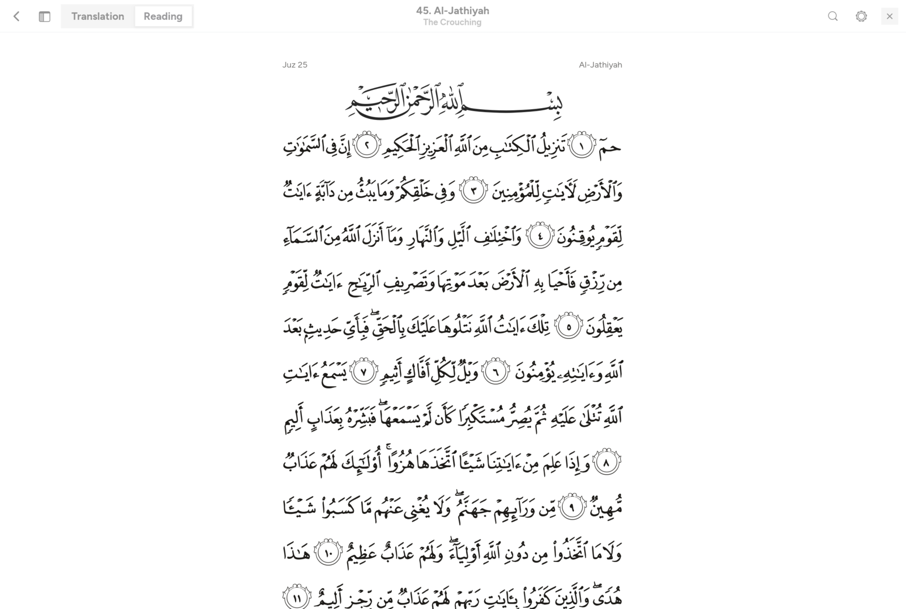
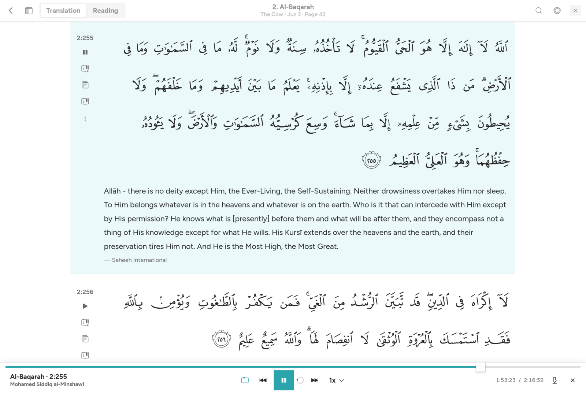
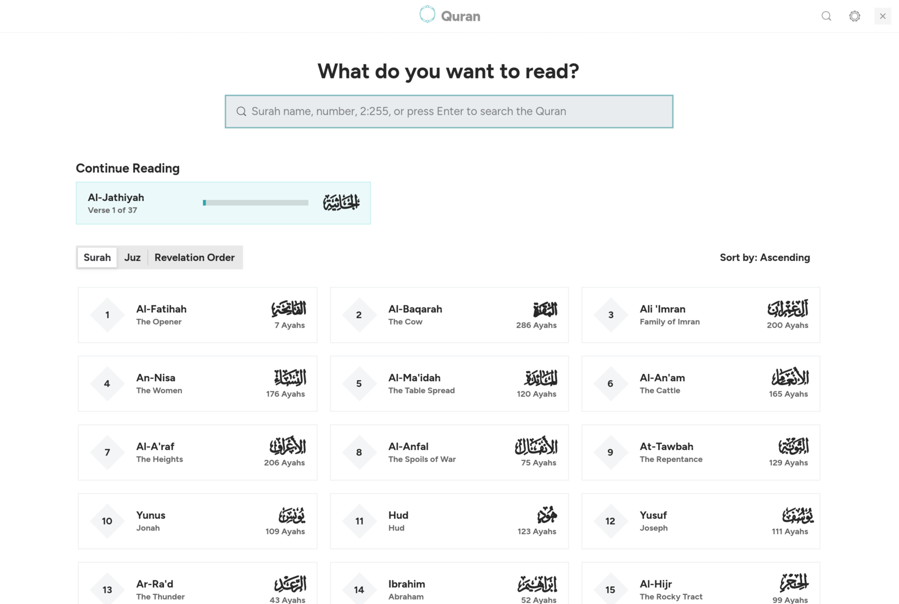
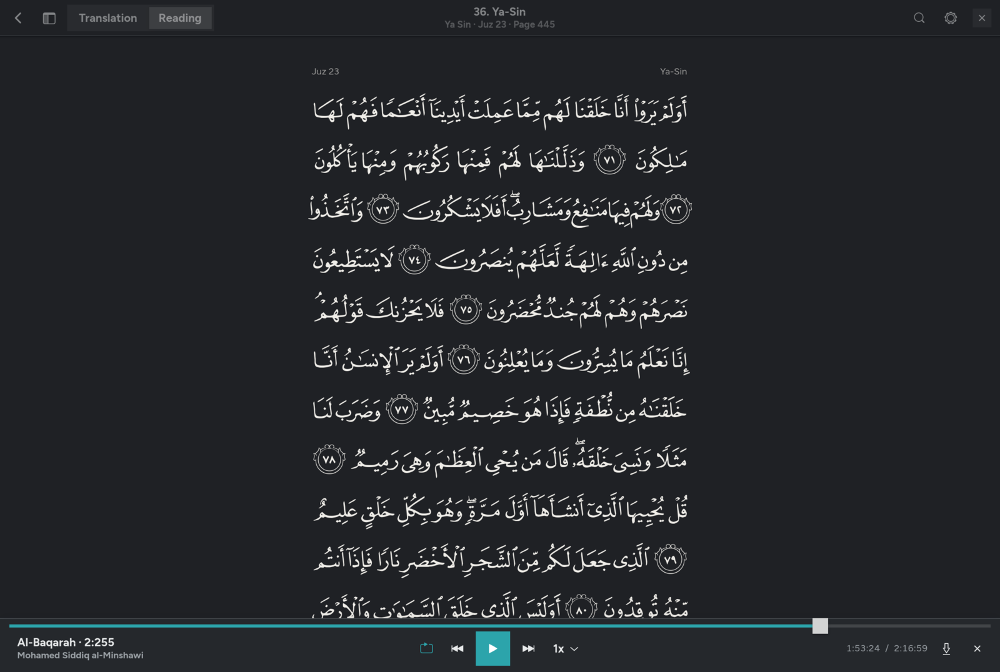
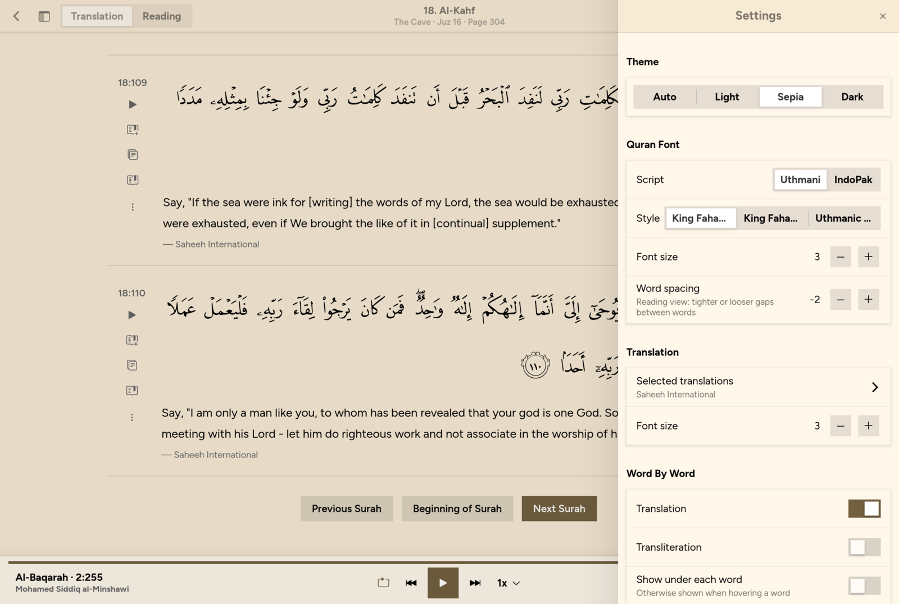

# Quran

A fast, native Quran app for the Linux desktop, modelled on [quran.com](https://quran.com).
Written in Rust with GTK4, libadwaita and GStreamer.

<p align="center">
  
  
</p>

## Features

- **Reading view** laid out like the printed Madani Mushaf: 15 justified lines per
  page, surah banners and Bismillah, using the King Fahd Complex page fonts
  (V1 — 1405 AH print, or V2 — 1421 AH print). Uthmanic Hafs and IndoPak scripts too.
- **Translation view**, verse by verse, with any number of translations and
  word-by-word translation/transliteration (on hover or inline).
- **Recitations** from many reciters with verse and word highlighting that follows
  the audio, repeat (verse/surah), playback speed, offline download, and media
  keys / desktop controls via MPRIS.
- **Tafsir**, surah info, full-text search, bookmarks and "continue reading".
- **Themes**: light, sepia, dark, or follow the system.
- **Offline cache**: every surah, translation and timing you open is stored locally
  and loads instantly afterwards.

## Screenshots

| Home | Reading (dark) | Settings (sepia) |
| --- | --- | --- |
|  |  |  |

## Install

All methods need GTK4, libadwaita and GStreamer. On Arch Linux:

```sh
sudo pacman -S --needed gtk4 libadwaita gstreamer gst-plugins-base gst-plugins-good
```

(Debian/Ubuntu: `libgtk-4-dev libadwaita-1-dev libgstreamer1.0-dev
libgstreamer-plugins-base1.0-dev gstreamer1.0-plugins-good`; Fedora:
`gtk4-devel libadwaita-devel gstreamer1-devel gstreamer1-plugins-base-devel
gstreamer1-plugins-good`.) Building also needs a Rust toolchain (`rustup` or your
distro's `rust` package).

### Arch Linux (PKGBUILD)

```sh
git clone https://github.com/mikailbayram/quran && cd quran/packaging/arch
makepkg -si
```

Installs `quran` to `/usr/bin` with a desktop entry and icon, as the
`quran-desktop-git` package.

### Install script (any distro)

```sh
git clone https://github.com/mikailbayram/quran && cd quran
./scripts/install.sh                     # to ~/.local (binary, desktop entry, icon)
sudo PREFIX=/usr/local ./scripts/install.sh   # system-wide
./scripts/install.sh --uninstall         # remove (keeps your data)
```

### Cargo

```sh
cargo install --git https://github.com/mikailbayram/quran quran-desktop
```

This installs only the `quran` binary to `~/.cargo/bin` (no menu entry).

### Run from source

```sh
cargo build --release
./target/release/quran            # open the home screen
./target/release/quran 2:255      # jump straight to a verse
./target/release/quran 18         # or a surah
```

The first time a surah is opened it needs an internet connection; after that it
works offline. Recitations stream unless downloaded from the player bar.

### Keyboard shortcuts

| Keys | Action |
| --- | --- |
| `Ctrl+K` / `Ctrl+F` | Search |
| `Ctrl+,` | Settings |
| `Ctrl+R` | Switch Translation / Reading |
| `Space` | Play / pause |
| `Alt+←` / `Alt+→` | Previous / next verse |
| `Ctrl++` / `Ctrl+-` | Bigger / smaller text |
| `Alt+Home` | Back to home |

## Project layout

```
crates/
  quran-core/     platform-independent core: API client, SQLite cache,
                  models, settings, bookmarks (reusable for mobile front ends)
  quran-desktop/  GTK4/libadwaita front end
    src/ui/       home, reader (translation + Mushaf views), player bar,
                  settings drawer, search, dialogs
    resources/    bundled fonts and artwork
data/             desktop entry and app icon
packaging/arch/   PKGBUILD
scripts/          install.sh
docs/screenshots/
```

Data and settings live in `~/.local/share/quran-desktop/` (SQLite database,
downloaded page fonts and recitations). If the app ever crashes, a backtrace is
appended to `crash.log` there.

## Data sources

- Quran text, translations, tafsir, word-by-word data:
  [quran.com API](https://api.quran.com/api/v4) (Quran Foundation)
- Recitations and verse/word timings: quran.com audio API
  (files served by [QuranicAudio](https://quranicaudio.com))
- Fonts and Bismillah artwork: King Fahd Glorious Quran Printing Complex (QPC)
  fonts, IndoPak and surah-name fonts as distributed by
  [quran.com-frontend-next](https://github.com/quran/quran.com-frontend-next);
  UI font [Figtree](https://github.com/erikdkennedy/figtree) (OFL)

The app shows text as served by the API; it does not yet verify it against a
second source.

## Development

Opt-in debugging hooks (not used in normal runs):

- `QURAN_DEBUG_DIR=/tmp/qd` — accepts commands written to `/tmp/qd/cmd`
  (`open 2:255`, `mode reading`, `font v1`, `theme sepia`, `snap name`,
  `t open 2` to time an interaction, …). See `src/debug.rs`.
- `QURAN_PROFILE=1` — collects timing spans, printed by the `prof` debug command.
- `QURAN_LAYOUT_DEBUG=1` — logs Mushaf line widths and word gaps.

```sh
cargo test -p quran-core
```
